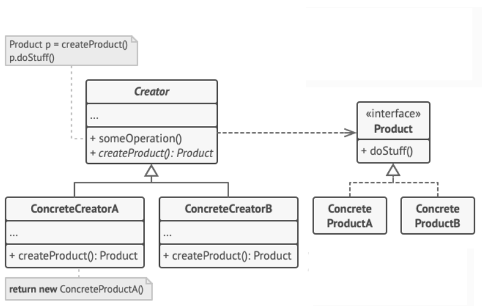

# The Factory Method
is a **Creational Design Pattern** that allows an interface or a class to create an object, but lets subclasses decide which class or object to instantiate

## Structure


## Steps:

1. **Product**: declares the interface, which is common to all objects that the creator class and its subclasses can produce.s
2. **Concrete Products**: are different implementations of the product interface.
3. **Creator class**: declares the factory method that returns new product objects. It is important that the return type of this method matches the product interface.
4. **Concrete Creators**: overwrite the base Factory Method, so that it returns a different type of product.

*This text will be italic*
_This will also be italic_

**This text will be bold**
__This will also be bold__

_You **can** combine them_

```python
a = 23
print(f"Hola {a}")

```

_Joel_

___Joel___

~~this~~

@Joel Rega 

I think you should use an
`<addr>` element here instead.


[GitHub](http://github.com)


`Especial caracter`

> Joel estamos viendo un cuadro adicional
sdfque favil mentes # vamos 


First Header | Second Header
------------ | -------------
Content from cell 1 | Content from cell 2
Content in the first column | Content in the second column

1. Item 1
1. Item 2
1. Item 3
   1. Item 3a
   1. Item 3b

* Item 1
* Item 2
  * Item 2a
  * Item 2b


